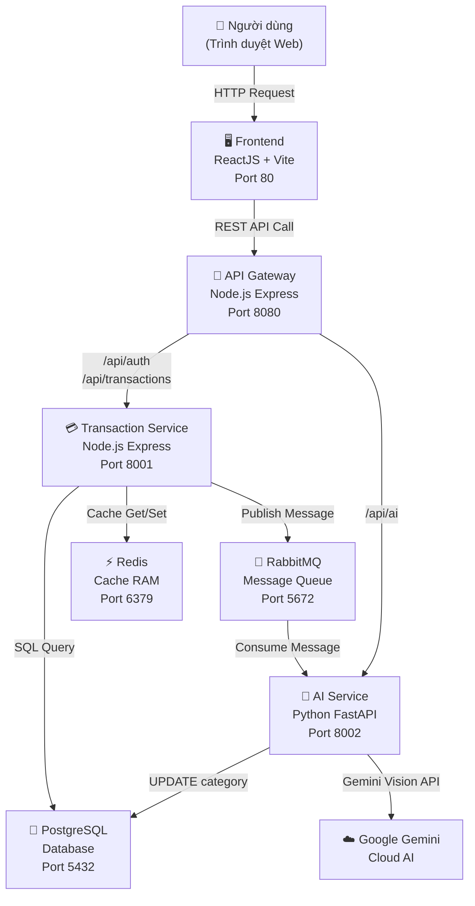
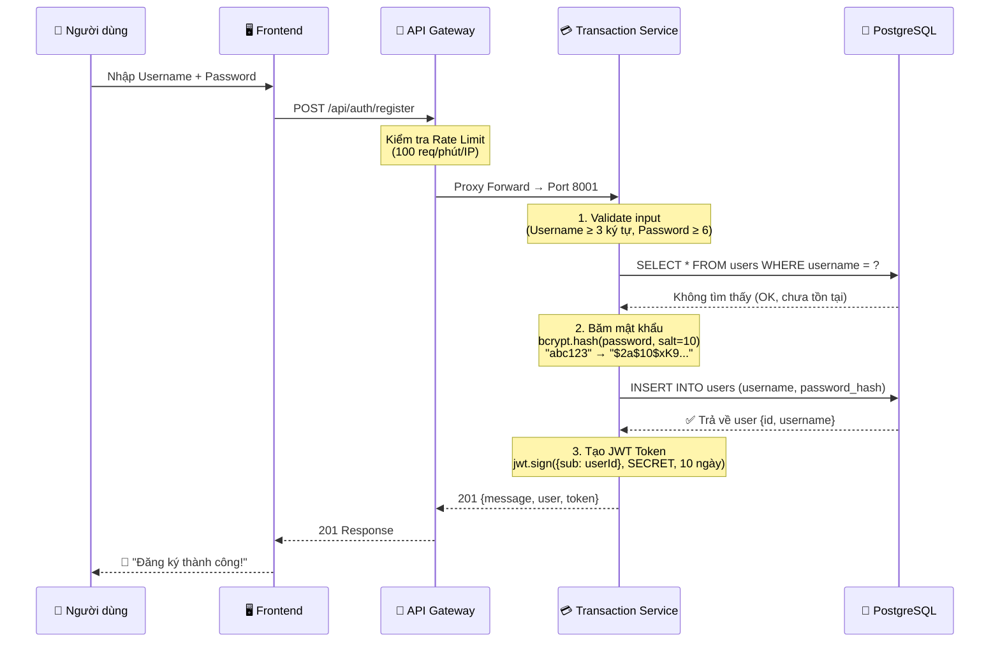
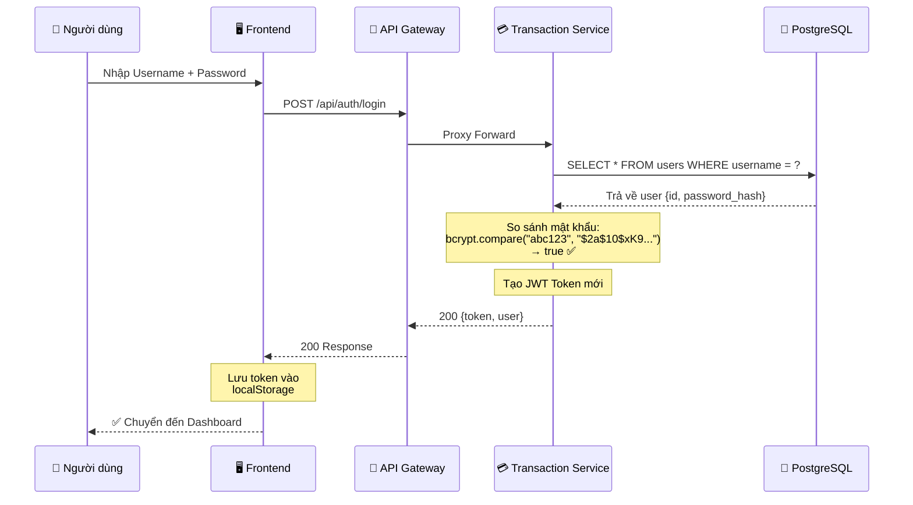
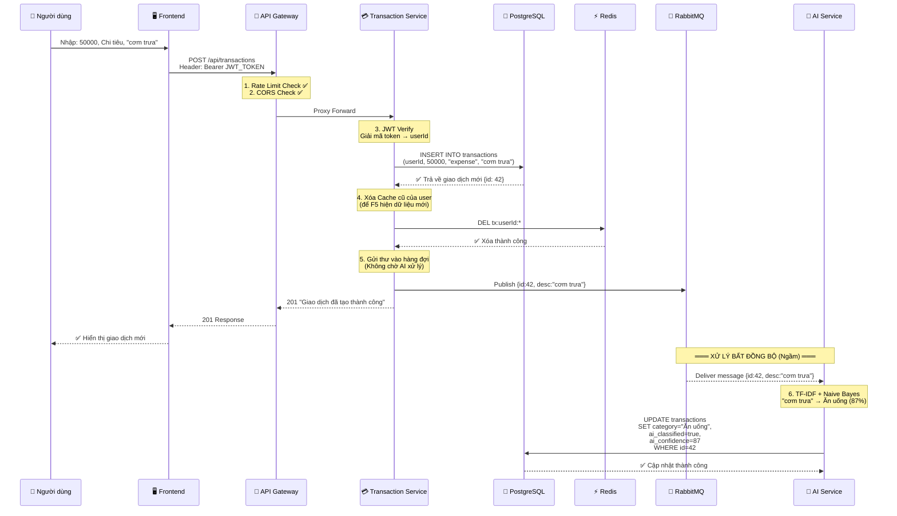
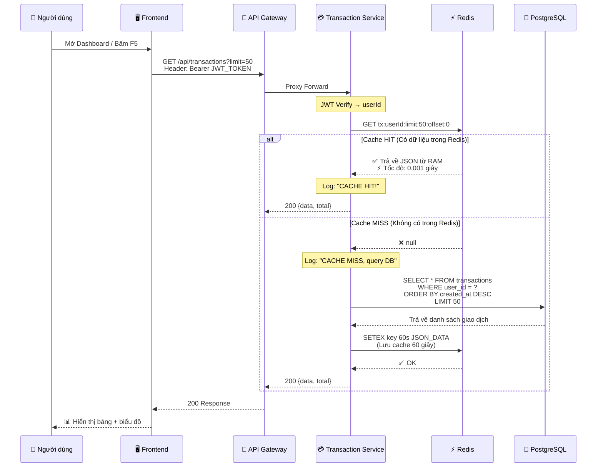
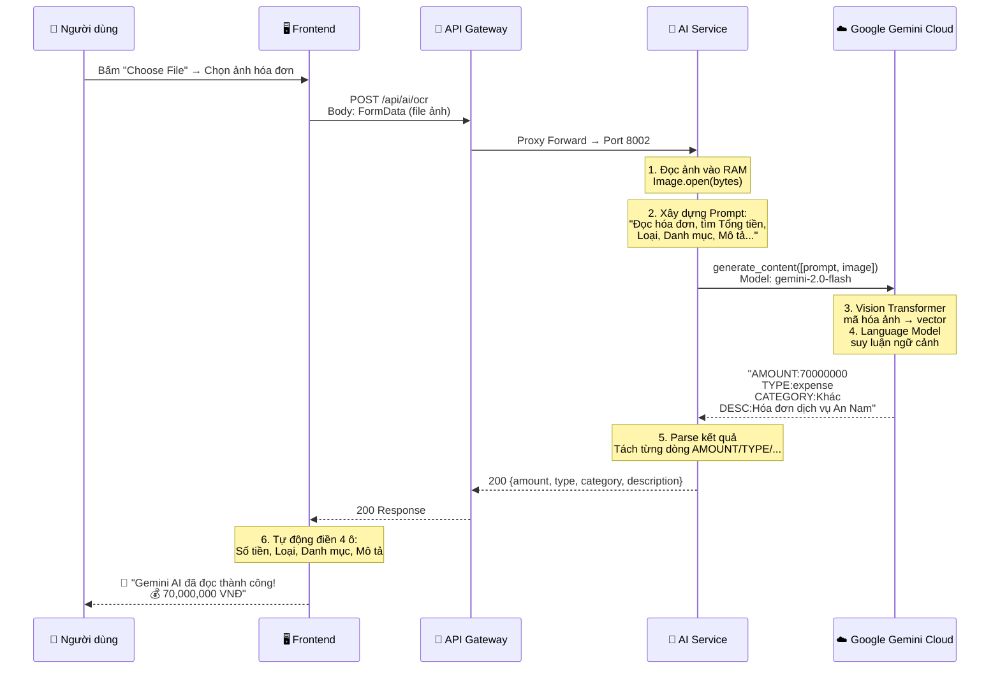
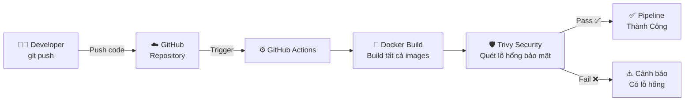

# 🔄 PIPELINE & FLOWCHART – LUỒNG HOẠT ĐỘNG CỦA TỪNG SERVICE

> Tài liệu này mô tả chi tiết luồng dữ liệu đi từ đâu, qua những service nào, xử lý gì, và trả kết quả về đâu.

---

## 📌 Sơ Đồ Kiến Trúc Tổng Thể

---

## 🔐 Pipeline 1: ĐĂNG KÝ TÀI KHOẢN

**Giải thích kỹ thuật:**
- **Bcrypt (salt=10):** Mật khẩu "abc123" bị xay qua 10 vòng băm → biến thành chuỗi "$2a$10$xK9..." dài 60 ký tự. Không thể giải ngược lại.
- **JWT Token:** Là thẻ từ có hạn 10 ngày, chứa mã số người dùng (userId). Frontend giữ thẻ này để gửi kèm mỗi request sau đó.

---

## 🔑 Pipeline 2: ĐĂNG NHẬP

---

## ➕ Pipeline 3: THÊM GIAO DỊCH MỚI (Có AI phân loại ngầm)

**Giải thích kỹ thuật:**
- **Bước 1-5 (Đồng bộ):** Người dùng bấm "Thêm" → Nhận kết quả ngay lập tức (< 0.1 giây). Không phải chờ AI.
- **Bước 6 (Bất đồng bộ):** AI Service âm thầm rút thư từ RabbitMQ, phân loại "cơm trưa" = "Ăn uống", rồi tự cập nhật Database. Lần sau F5 trang sẽ thấy nhãn "✨ AI" xuất hiện.

---

## 📋 Pipeline 4: XEM DANH SÁCH GIAO DỊCH (Có Redis Cache)

**Giải thích kỹ thuật:**
- **Lần F5 đầu tiên:** Cache MISS → Query PostgreSQL (chậm hơn) → Lưu kết quả vào Redis 60 giây.
- **Lần F5 thứ 2 (trong 60s):** Cache HIT → Lấy thẳng từ RAM Redis (nhanh gấp 100 lần) → Database không bị động.
- **Khi thêm giao dịch mới:** Cache cũ bị XÓA (Pipeline 3, bước 4) → Lần F5 kế sẽ tải lại dữ liệu mới nhất.

---

## 📸 Pipeline 5: QUÉT HÓA ĐƠN BẰNG GEMINI AI VISION

---

## 🔄 Pipeline 6: CI/CD GITHUB ACTIONS

---

## 📊 Tổng kết: Bảng So Sánh Vai Trò Từng Service

| Service | Ngôn ngữ | Port | Vai trò chính | Giao tiếp với |
|---------|----------|------|---------------|---------------|
| **Frontend** | ReactJS | 80 | Giao diện người dùng, biểu đồ | → API Gateway |
| **API Gateway** | Node.js | 8080 | Bảo mật (CORS, Rate Limit), Định tuyến | → Transaction, AI |
| **Transaction Service** | Node.js | 8001 | Xác thực JWT, CRUD giao dịch, Cache Redis | → PostgreSQL, Redis, RabbitMQ |
| **AI Service** | Python | 8002 | Phân loại TF-IDF, Quét ảnh Gemini Vision | → PostgreSQL, RabbitMQ, Google Cloud |
| **PostgreSQL** | SQL | 5432 | Lưu trữ dữ liệu vĩnh viễn | ← Transaction, AI |
| **Redis** | In-Memory | 6379 | Bộ nhớ đệm tốc độ cao | ← Transaction |
| **RabbitMQ** | AMQP | 5672 | Hàng đợi tin nhắn bất đồng bộ | ← Transaction → AI |
